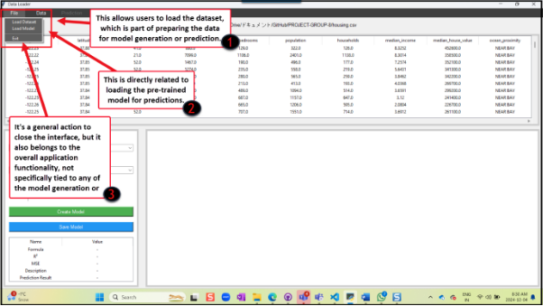
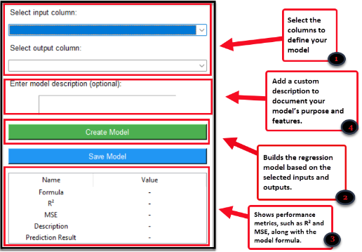

<table><tr><th colspan="2" valign="top"><h1><b>‘PredictEase’ Application                                      Readme File</b> </h1></th><th rowspan="1" valign="top"><h1>![A cartoon of a bee

Description automatically generated]</h1></th></tr>
<tr><td valign="top"><h1></h1></td><td valign="top"><h1>Version 1.0</h1></td><h1></h1></tr>
</table>

![A cartoon of a bee

Description automatically generated]
#
# **Table of Contents**	
[About this User Guide	2******](#_toc184204601)***

[***Overview	2******](#_toc184204602)

[**Project Features	2****](#_toc184204603)

[***Getting Started	3******](#_toc184204604)

[**Hardware/System Requirements	3****](#_toc184204605)

[Operating System-Specific Requirements	3](#_toc184204606)

[General Hardware Requirements	3](#_toc184204607)

[***PredictEase Interface Navigation	4******](#_toc184204608)

[**Overview of User Interface Components	4****](#_toc184204609)

[Loading a Model Interface	4](#_toc184204610)

[Model Generating Interface	5](#_toc184204611)

[Graph Interface	7](#_toc184204612)

[***Functions and Usage of PredictEase	8******](#_toc184204613)

[**Using PredictEase	8****](#_toc184204614)

[**Opening Data Files	8****](#_toc184204615)

[**Entering a Model Description	9****](#_toc184204616)

[**Building the Model	9****](#_toc184204617)

[**Processing and Saving Model	10****](#_toc184204618)

[**Predicting Values from Data Files	10****](#_toc184204619)

[**Loading Previous Models	12****](#_toc184204620)

[***Additional Information	12******](#_toc184204621)

[**Contributing to PredictEase Guidelines	12****](#_toc184204622)

[**Contribution Process	12****](#_toc184204623)

[**Reporting Issues	12****](#_toc184204624)

[**Acknowledgements	13****](#_toc184204625)

[***Glossary Terms	15******](#_toc184204626)

# **About this User Guide**
This guide helps you set up and use the Linear Progression Software for creating and analyzing predictive models. Whether you are a business manager, data analyst, or general user, you'll find clear steps to get the most out of the software's features.
# **Overview** 
The Dataloader App simplifies the process, of uploading and managing data for various purposes. It helps you work efficiently with spreadsheets, databases, or files, making the process easy and hassle-free—even if you’re new to data management!
## Project Features 
In this section, you will discover the key features of PredictEase ([as shown in Table 1.1)](#_project_features), a user-friendly software designed to simplify regression modelling and predictive analysis.

|**Features**|**Description** |
| :- | :- |
|**Data Import and Management**|
- Import data from multiple formats, including CSV, Excel, and SQLite.

- Select and manage variables to tailor your model to specific needs.
|
|**Model Generating Interface and Customization**|
- Create simple linear regression models to identify relationships in data.

- Adjust model parameters as needed for tailored results.
|
|**AI-Enhanced Predictions**|
- Use AI to refine model accuracy and make predictions that adapt to new data inputs.

- Enable automatic updates to model predictions with AI-driven improvements.
|
|**Interactive Data Visualization**|
- View data trends and model results through easy-to-interpret charts and graphs.

- Explore visualizations with interactive features for better insights and data storytelling.
|
|**Model Management**|
- Save and load models for ongoing analysis or future reference.

- Export model reports in PDF or Excel formats for easy sharing and presentation.
|
|**User-Friendly Interface**|
- Simple, intuitive design for easy navigation.

- Step-by-step guidance through Model Generating Interface and analysis.
|

***Table 1.1: Project Features***
# **Getting Started**
Welcome to PredictEase – an easy-to-use tool for data analysis and regression modelling, created through a collaboration between Seneca Polytechnic (Canada) and Universidade da Coruña (Spain) as part of the COIL Project.

With PredictEase, you can upload data, analyze it, visualize results, and manage regression models on a user-friendly Python-powered platform, making data-driven decisions simple for everyone, from beginners to experts.
## Hardware/System Requirements
To use PredictEase effectively, [(see. Table 2.1 and Table 2.2)](#_operating_system-specific_requireme) ensure your system meets the following hardware and software requirements:
### Operating System-Specific Requirements

|**Operating System**|**Version**|
| :- | :- |
|Windows|Windows 10 (64-bit) or later|
|macOS|macOS 11.0 or later|
|Linux|Ubuntu 20.04 or equivalent|

***Table 2.1: System requirements for Mac and Windows devices.***
### General Hardware Requirements

|**Component**|**Requirement**|
| :- | :- |
|

Processor
|Dual-Core CPU (2.0 GHz or higher) / Intel Core i5 or equivalent|
|Memory (RAM)|6 GB minimum|
|Storage|500 MB of free disk space|
|

Graphics
|Integrated graphics capable of displaying 1280 x 720 resolution|

***Table 2.2. Minimum Hardware Specifications for Optimal Performance.***

**Additional Notes**

- **Internet Connection**: Required for downloading dependencies, updates, and certain online data integrations.
- **Supported File Formats**: CSV, Excel (.xlsx), SQLite databases.
- **Environment**: A stable and secure computing environment is recommended to avoid data loss or application interruptions.

  For installation guidance and troubleshooting, refer to the [**docs**](https://github.com/irenetembras/PROJECT-GROUP-8/tree/main/docs) section of the user documentation.
# **PredictEase Interface Navigation**
PredictEase has a simple, intuitive interface designed to help you create, manage, and visualize regression models. 
## Overview of User Interface Components
The user interface is designed to provide a seamless experience for building, managing, and visualizing models. It is organized into three key components:

The user interface contains three parts: 

- Loading a model interface 
- Model generating interface 
- Graph interface  
### Loading a Model Interface 
The "Loading a Model" interface (see [Figure 1.1](#_loading_a_model) for more details) lets you upload and manage pre-saved models. The key features and button positions are as follows:

`  `**File Dropdown**

- Load Dataset
- Load Model
- Exit

[***Figure 1.1 Loading Model Interface***](#_loading_a_model)
### Model Generating Interface
The **Model Generating Interface** (see [Figure 2.1](#_model_generating_interface) for more details)  provides tools for creating and refining your models. Key features include:

- Input and Output Dropdowns (left-top)
- Create Model Button (below dropdowns, centre)
- Metrics Display Area (below the button)
- Description Field (bottom centre)

|**Note: The following screenshot and table show the function of each null data preprocessing button.** |
| :- |

***Figure 2.1: Model generating Interface*** 

**Data Dropdown**

This section is about the drop-down list [(see, Figure 3.2)](#_model_generating_interface) that contains options to handle empty cells with no value, such as “n/a”, “na”, “non” and “nan” The software offers different options.

|**Options** |**Functions** |
| :- | :- |
|Remove rows with Nan|To delete the entire rows that contain the empty cell(s). |
|Fill with mean |Fill empty cells with the mean of remaining values.|
|Fill with median|To fill all empty cells with the median of the remaining cells’ value of the row. |
|Fill with a constant|To fill all empty cells throughout the row with specific values. You must manually enter the constant value. |

***Table 3.1: Options in the Handle missing Data drop-down list.***

***Figure 3.2 Data Dropdown Menu***

**Use Case Scenario** **for Data Dropdown**

A data analyst prepares a dataset for analysis and notices several empty cells. These missing values could affect the accuracy of the results. The analyst uses the Data Dropdown feature to handle the empty cells.

**Data Analyst:**

1. Uploads the dataset into the PredictEase App and identifies empty cells (e.g., “n/a”, “na”, “non”, or “nan”).
1. Opens the Data Dropdown menu and selects one of the following** options
1. Removes rows with critical missing values.
1. Replaces missing numerical values with the column mean.
1. Replaces missing values with the column median to avoid the impact of outliers.
1. Replaces missing values with a specified constant (e.g., “0” or “unknown”).

**Outcome:**

The dataset is now consistent and ready for analysis. The missing values are handled based on the selected strategy, ensuring the integrity of the results.

The Data Dropdown gives users control over missing data, streamlining data preparation.
### Graph Interface 
The **Graph Interface** in the Dataloader app enables users to visualize data and model predictions clearly and interactively. It supports types of graphical representations, helping users analyze the dataset and model outcomes efficiently. 

**Graph Area (Center of the Interface) [(See. Figure 4.1)**](#_graph_interface)**

- The current graph displays based on the selected dataset or model predictions.
- Graph types may include scatter plots, line graphs, bar charts, etc.
- Updates dynamically when the user selects different datasets or model predictions.

**Legend and Axis Labels [(See, Figure 4.1)**](#_graph_interface)**

- Automatically generated when a graph is plotted.
- Provides information about data series, axis labels, and units, ensuring clear interpretation of the graph.

`       `***Figure 4.1 Grap Area Interface***

**Prediction Dropdown**

- Use the model to predict outcomes based on the dataset. [(see, Figure 4.2)](#_graph_interface)

*Figure 4.2 Prediction dropdown*
# Functions and Usage of PredictEase
This section describes how to use PredictEase functions to build a linear regression model. 
## Using PredictEase
To use PredictEase, make sure your data file is up to date and all data is correctly defined. You can use PredictEase to process and save data sets, generate models for data analysis and prediction, and reload saved models for continuous analysis and customization. 

## Opening Data Files 
To start using PredictEase open the data file. PredictEase works with CSV, Microsoft Excel, SQLite, .db and .xls

To open the data file: 

1. Open Predict Ease 
1. Click **File** dropdown** in the menu bar.** 

A file dialog box opens to choose the dataset file.

1. Select the compatible Data File > **Open** 
1. The data chart appears 

The selected data file opens in PredictEase, and the data chart is displayed, ready for analysis.
##
##
##

## Entering a Model Description 
After opening the compatible data file in the software, you will now process the data. 

1. Locate the **Input Column** (independent variables) dropdown menu on the left of the home screen. 
1. Click the dropdown menu and select the desired independent variable (e.g., a column representing "Advertising Budget").
1. Locate the **Output Column** (dependent variables) dropdown menu on the left of the home screen. 
1. Click the **dropdown**.
1. Select the desired dependent variable (e.g., a column representing "Sales").

`                `You are now set to proceed with further model settings or data processing.

|**Important: Models cannot be generated if there are null data present. A Warning sign shows if you have null data. See Processing and Saving Model for more details on editing null data.**|
| :- |
##
## Building the Model
Generate and visualize the regression model using the selected variables.

1. Confirm the set input and output variable. 
1. Click the **Create Model** button.
1. Review the results:

   A graph with the regression line and data points.

   Metrics including:

- R² (Coefficient of determination).
- MSE (Mean squared error).
- Description 
- Prediction Result

The regression model is visualized, and key metrics are displayed.
##
##
##

## Processing and Saving Model
This section guides you in processing and saving your regression model for future use. Define input and output variables, generate the model, evaluate its performance, and save it for reuse.

To process and save a file after creating the model: 

1. Click **Data** in the menu bar 
1. Select the processing option from the list.
1. Select **Save Model.** 

   The Save as dialog will appear.** 

1. Enter a file name and click **Save.**

   A success dialog appears to indicate that the model data has been saved. 

1. Click **Ok.**

`       `The model is processed and saved successfully**.**
## Predicting Values from Data Files
This section shows how to predict values using your data files in PredictEase. Load a data file, select input variables, and generate predictions with your regression model.

To predict a value: 

1. Go to **Prediction** in the Menu bar. 
1. Select **Make Prediction**.

   The app displays a **Prediction Input** dialog box. 

1. Click **OK**

   Note: If you do not see this test result, you may need to minimize the PredictEase window to full screen.

1. Select **Save Model** to save the prediction. 

   The app displays the Prediction Input dialog box.

**Use Case: Predicting House Prices Using PredictEase**

**Title:** Predicting House Prices Based on Location and Size

**Actor:** Jane (Person trying to buy a house)

**Goal:** The homebuyer wants to predict the price of a house based on its location and size.

**Preconditions:**

- Jane has access to the PredictEase app.
- Jane has a data file with information about house prices, locations, and sizes.

|**Note: The prediction measure for the use case is 150.**|
| :- |

**Main Flow of the homebuyer:**

1. Opens the PredictEase app.
1. Uploads a data file that includes house prices, locations, and sizes.
1. Selects "**Median income**" and "**Median house value"** as the input and output variables.
1. The app processes the data and generates a predicted house price ([see Figure 5.1](#_entering_a_model) for the result).

`       `Jane reviews the predicted price for a house based on their desired location and size.

**Postconditions:**

- The homebuyer receives an estimated house price based on the selected location and size.

**Alternative Flow:**

- If the data file is not in the correct format, the app prompts the homebuyer to upload a valid file.

**Location and Size:** The homebuyer can choose any location and enter the desired size of the house (e.g., square footage) to predict the house price.

*Figure 5.1 Linear progression graph showing the predicted house price based on location and size.*
## Loading Previous Models 
In this section, you will learn how to load a saved model from your desktop and work with the dataset. This allows you to use customized data for predictions. Simply locate the saved file on your desktop, load it into the app, and start processing the dataset for predictions. 

To load model: 

1. From the PredictEase interface, select **Load Model**. 
1. The **File Explorer** dialog will open.
1. Select a previously saved file
1. Select **Open** > **OK**.

   The previously generated model will display. 
# Additional Information
This section will guide you through the contribution process to ensure a smooth and effective experience.
## Contributing to PredictEase Guidelines
Thank you, for your interest in contributing to PredictEase! Your insights and expertise are invaluable in helping us improve our platform and resources.

To ensure a smooth and effective contribution process, please follow these guidelines:
## ` `Contribution Process 
- Fork the repository** making sure, not to cover any code in the main branch.
- Create a new branch for your features or bug fixes. 
- Make the necessary changes, then commit to your branch. 
- Submit a pull request. We will notify the creators and contact you when the request 	is confirmed or if more information is needed before approving the changes. 
  ## Reporting Issues
  If you encounter an issue while using the PredictEase App, we encourage you to report it here so we can address it promptly.
  ##
  ##

  ## Acknowledgements 
  We could not have developed and succeeded with the PredictEase App without the invaluable contributions of several individuals. We extend our heartfelt gratitude to:

  **Program Co-ordinator and Instructor**

- **Amy Briggs**, Seneca Polytechnic: For her guidance and dedication to fostering innovation and excellence in the Technical Communication Graduate Program.

**Subject Matter Expert**

- **Dr. Alberto José Alvarellos González**, Universidade da Coruña: For sharing his expertise in Computer Science and Artificial Intelligence, offering valuable direction and encouragement.

**Development Team**
A sincere thank you to the developers for their hard work, creativity, and commitment to bringing PredictEase to life.

**Alvaro Carpio (Universidade da Coruña)**                                                                                                Role: Developer 

- Focused on backend functionalities, including data validation and regression algorithms. 
- Contributed to interface improvements, including enhancing the user experience ([UX](#_glossary_terms)) and user interface ([UI](#_glossary_terms)) design. 
- Responsible for organizing the codebase and improving its modularity and maintainability. 

**Alba González Peña** **(Universidade da Coruña)**                                                                                 Role: Code Structure Specialist

- Responsible for organizing the codebase and improving its modularity and maintainability. 
- Focused on backend functionalities, including data validation and regression algorithms. 
- Contributed to interface improvements, including enhancing the user experience (UX) and user interface (UI) design. 

**Irene Tembrás Díaz (Universidade da Coruña)**                                                                                      Role: Library Researcher 

- Conducted research to identify and select appropriate ML libraries for the project. 
- Implemented prediction functionalities based on the chosen libraries. 
- Contributed to interface improvements and code structuring 
- Assisted with project documentation, ensuring clarity and consistency. 

**Nawfal Heiloua (Universidade da Coruña)**                                                                                             Role: Developer and Scrum Leader                                 

- Facilitated team meetings, sprint planning, and retrospectives to maintain alignment with Agile methodologies. 
- Focused on backend functionalities, including data validation and regression algorithms.
- Assisted with project documentation, ensuring clarity and consistency.

We are deeply grateful to everyone who contributed to this journey. Your support and collaboration have been instrumental in making PredictEase a reality. Thank you!
#
**Hope you enjoy using the software!**

**
# **Glossary Terms**
**Technical Terms and Definitions**

- **PredictEase**

`                `A Python-based platform designed for regression modeling and data analysis.

- **Regression Models**

  Models that predict outcomes by analyzing relationships between dependent and independent variables in datasets.

- **Linear Regression**

  A method to model the relationship between a dependent variable and one or more independent variables using a straight line.

- **Model-View-Controller (MVC)**

`               `A software design pattern that separates an application into:

- **Model**: Data and business logic
- **View**: User interface (UI)
- **Controller**: Manages user input and updates the model and view.
- **Mean Squared Error (MSE)**

  A measure of model accuracy, calculating the average squared difference between actual and predicted outcomes.

- **R² (Coefficient of Determination)**

  A statistical metric that indicates how well independent variables predict the dependent variable, ranging from 0 (poor) to 1 (perfect).

- **GitHub**

  A platform for version control and collaboration, using Git to manage code changes.

- **Visual Studio Code**

  A free, open-source code editor that supports multiple programming languages and integrates with version control systems.

- **Cross-Platform Compatibility**

  The ability of software to run on different operating systems (Windows, macOS, Linux) without modification.

- **Preprocessing**

  The process of cleaning, transforming, and organizing data before analysis, including handling missing values and normalizing data.

- **Null Data**
  Missing or empty data points in a dataset that can affect the results of a model if not properly handled.
- **Data Dropdown**
  A user interface element that provides options for handling missing or null data in a dataset, such as filling missing values with the mean, median, or a constant value.
- **Prediction Dropdown**
  A menu within the software that allows users to make predictions using a loaded regression model.
- **File Dialog Box**
  A window that allows users to navigate through directories and select files for loading into the software.
- **Save Model Button**
  A feature that allows users to save their created or modified models for future use or reference.
- **Preprocessing**
  The process of cleaning and preparing data for use in a model, which may involve handling missing values, scaling, or transforming data.
- **Fork the Repository**
  A version control term, referring to making a copy of the code repository to work on independently before submitting changes.
- **Pull Request**
  A request to merge changes from one branch of a code repository into the main branch after the changes have been reviewed.
- **Continuous Analysis**
  The process of ongoing examination and refinement of data and models as new data is introduced or as performance improves.

**16 **|** Page

[A cartoon of a bee

Description automatically generated]: Aspose.Words.ab4286bc-6a0e-4f87-9126-b90094db08d4.001.png
